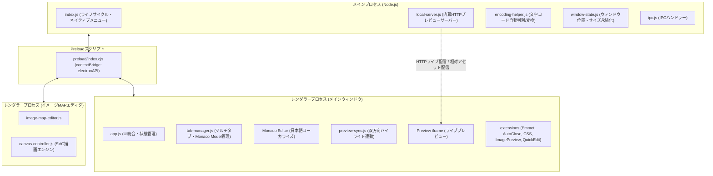

# Hisa HTML Editor (PCアプリ版) システム仕様書

- **文書名**: Hisa HTML Editor PCアプリ版 仕様書
- **対象バージョン**: v2.3.0
- **最終更新日**: 2026-09-15
- **対象プラットフォーム**: Windows (x64) / macOS (Apple Silicon & Intel)
- **ライセンス**: MIT License
- **開発元**: Hisa

---

## 1. システム概要

### 1.1 製品概要
「Hisa HTML Editor」は、従来のAdobe Dreamweaverの主要なHTML編集・プレビュー機能を代替・近代化することを目的として開発された高機能デスクトップHTMLエディタです。
VS Codeのコアである「Monaco Editor」を搭載し、最新のWeb標準コーディング、Emmet展開、CSSインテリセンス、リアルタイム双方向プレビュー、イメージMAP作成機能などを、軽量かつ直感的な操作感で提供します。

### 1.2 主な特徴
1. **Dreamweaver代替の制作体験**:
   - 画面分割（左右／上下／単独全画面）によるリアルタイム同期プレビュー。
   - プレビュークリックでコードジャンプ、コード選択でプレビューハイライト（双方向連動）。
   - クイック編集（`Ctrl+E`）によるインラインCSSダイレクト編集。
2. **高速・安心のネイティブ動作**:
   - 内蔵ローカルHTTPサーバーによるローカル相対パス（画像、外部CSS、JS）の完全プレビュー表示。
   - 日本語エンコーディング（UTF-8, Shift_JIS, EUC-JP）の自動判別と保存時の文字コード保持。
3. **リッチなコーディング補助**:
   - Emmet展開、タグ自動補完、自動閉じタグ（`<div>` → `<div></div>`）、終了タグ補完（`</`）。
   - HTML内の画像パスホバーによるサムネイル画像の即時プレビュー。
4. **イメージMAPビジュアルエディター内蔵**:
   - 矩形、円形、多角形のクリッカブルマップをGUIで描画し、HTMLコードを直接生成・更新。
5. **ポータブル配布**:
   - インストーラー不要のZip解凍型ポータブルパッケージに対応。

---

## 2. 動作環境および技術スタック

### 2.1 動作環境
| 項目 | 要件 |
| :--- | :--- |
| **対象OS** | Windows 10 / 11 (64-bit), macOS 11 (Big Sur) 以降 |
| **配布形式** | Windows: ポータブルZip (`.zip`) / 解凍後実行可能<br>macOS: ポータブルZip (`.app.zip`) |
| **前提ランタイム** | なし（Electron同梱のため、Node.js等の事前インストール不要） |

### 2.2 技術スタック
| 分類 | 採用技術 / ライブラリ | バージョン / 用途 |
| :--- | :--- | :--- |
| **デスクトップ基盤** | Electron | v35.0.0 |
| **エディタコア** | Monaco Editor | v0.52.2 |
| **ビルド / 開発サーバー** | Vite | v6.2.0 |
| **UIフレームワーク** | Vanilla HTML5 / CSS3 / ES Modules | 高速起動・軽量動作 |
| **文字コード処理** | encoding-japanese | v2.3.0 (UTF-8 / Shift_JIS / EUC-JP 自動判定) |
| **コード展開** | emmet-monaco-es | v5.4.1 (HTML / CSS Emmet略称展開) |
| **MIME解決** | mime-types | v2.1.35 (ローカルサーバー静的アセット解決) |
| **パッケージング** | electron-builder | v25.1.8 |

---

## 3. システムアーキテクチャ

### 3.1 プロセス構成
アプリケーションはElectronのマルチプロセスモデルに基づいて構築されています。



### 3.2 セキュリティ設計
- **`contextIsolation: true`**: レンダラープロセスからNode.js APIへの直接アクセスを遮断。
- **`nodeIntegration: false`**: セキュアな実行環境の維持。
- **`sandbox: false` / `webUtils.getPathForFile`**: ドラッグ＆ドロップによる安全なファイルパス取得。
- **プレビュー用サンドボックス**: プレビュー用iframeには `sandbox="allow-scripts allow-same-origin"` を付与し、かつ `window.open` の無効化および `<a>` タグのナビゲーション抑制処理を実施。
- **ローカルサーバー保護**: ディレクトリトラバーサル（`../` による不正参照）防止機構を実装。

---

## 4. 機能要件および詳細仕様

### 4.1 マルチタブ管理機能
- **複数ファイル編集**: 同時に複数のHTMLファイルを開いてタブ切り替えが可能。
- **未保存インジケータ**: 編集が発生したタブにはタイトル横に `*`（アスタリスク）と変更ドットを表示。
- **タブ一覧ドロップダウン**: タブ多数オープン時に、ツールバー右端のドロップダウンボタンから開いているタブ一覧を一覧選択可能。
- **マウスホイール横スクロール**: タブバー上でホイールを回すことで、左右にスムーズにスクロール。
- **終了・クローズ確認**: 未保存タブを閉じる際、変更の破棄を確認するネイティブダイアログを表示。
- **無題ドキュメント自動採番**: 新規作成時は「未保存のファイル 1」「未保存のファイル 2」と自動インクリメント。

### 4.2 Monaco Editor 統合と入力補助
- **日本語化**: Monaco Editorの標準メニュー（元に戻す、やり直す、コマンドパレット等）を日本語化。
- **タグ自動補完 & 自動閉じタグ**:
  - `>` 入力時、対応する終了タグ（例: `<div>` → `<div></div>`）を自動挿入し、カーソルを間に配置。
  - VOID要素（`img`, `input`, `br`, `hr`, `meta`, `link` 等）は自動判別して閉じタグを挿入しない。
  - `</` 入力時、最も内側にある未閉じタグを自動検出して補完。
- **Emmet 展開**:
  - `ul>li*3.item` のような略称を入力して `Tab` キーを押すことで、HTMLコードへ即時展開。
- **タグで囲む (Wrap with Abbreviation / `Alt+W`)**:
  - 選択範囲を任意のEmmet略称（例: `div.wrapper` や `a[href=#]`）でラップ可能。
- **文字コード自動判別 & 保持**:
  - ファイルオープン時にバイナリ解析（`encoding-japanese`）および `<meta charset="...">` の両面からエンコーディング（UTF-8, Shift_JIS, EUC-JP）を高精度判定。
  - 上書き保存時は元のエンコーディングを維持してバイナリ変換保存（文字化け防止）。

### 4.3 CSSインテリセンス & クイック編集
- **クラス名・ID名サジェスト**:
  - HTML内の `<style>` タグおよび `<link rel="stylesheet">` で読み込んでいる外部CSSをバックグラウンド解析。
  - `class="..."` や `id="..."` 入力時にCSSルール一覧を候補表示。
- **CSS定義ジャンプ (`F12`)**:
  - クラス名やID名上で `F12` を押すと、定義元のCSSルール行へジャンプ。
- **CSSクイック編集 (`Ctrl+E`)**:
  - HTMLタグ、クラス名、ID名上で `Ctrl+E` を押すと、該当するCSS定義を展開するインラインサブエディタがエディタ内に表示される。
  - サブエディタでCSSプロパティを修正すると、内部`<style>`またはCSS定義に即時反映。
  - CSSルールが存在しない場合は、`<style>`内に新規ルール枠を自動生成。
- **画像サムネイルホバープレビュー**:
  - `src="..."` や `href="..."`、`url(...)` などの画像パス（png, jpg, gif, svg, webp 等）にマウスカーソルを乗せると、Tooltip内に画像サムネイル、ファイル名、ファイルサイズを表示。ローカル相対パスおよびHTTP(S)パスに対応。

### 4.4 プレビュー & 双方向同期
- **内蔵HTTPプレビューサーバー**:
  - ポート番号は動的空きポートを採用（ポート競合を防止）。
  - HTML更新時は動的エンドポイント（`/__preview_live.html`）経由でプレビューを高速同期更新。
  - プロジェクトルート配下のCSS・画像・JavaScriptをWebサーバー経由で読み込むため、ブラウザセキュリティによる相対パス遮断が発生しない。
- **双方向クリック連動 & ハイライト**:
  - **プレビュー → エディタ**: プレビュー内のHTML要素をクリックすると、エディタ側の該当タグ行へ自動スクロール＆カーソル移動。
  - **エディタ → プレビュー**: エディタ内でカーソルがあるタグに対応するプレビュー要素に青色ハイライト枠をリアルタイム表示。
- **レスポンシブプレビュー**:
  - プレビュー上部のトグルで、表示幅をワンクリック切り替え可能。
    - **PC**: 100%（フル幅）
    - **タブレット**: 768px
    - **スマホ**: 375px

### 4.5 画面レイアウト & カスタマイズ
- **4種類の画面レイアウト切替**:
  - **左右分割 (Horizontal)**: 左側にプレビュー、右側にエディタ（`Ctrl+1`）
  - **上下分割 (Vertical)**: 上側にプレビュー、下側にエディタ（`Ctrl+2`）
  - **エディタのみ全画面**: プレビューを非表示にしてコードに集中（`Ctrl+3`）
  - **プレビューのみ全画面**: エディタを非表示にして表示確認（`Ctrl+4`）
- **境界ドラッグ（スプリッター）**:
  - プレビューとエディタの境界線をマウスドラッグすることで、任意の比率に無段階調整可能。
- **設定ダイアログ**:
  - テーマ: ダーク (`dark`) / ライト (`light`) / システム連動 (`system`)
  - フォントサイズ: 12px / 14px / 16px / 18px
  - タブ幅: 2 / 4 スペース
  - 行番号の表示／非表示
  - 行の自動折り返しのON／OFF
  - 設定内容は `localStorage` に自動永続化。

### 4.6 イメージMAPビジュアルエディター (`Alt+M`)
HTMLのクリッカブルマップ（`<map>` および `<area>` タグ）をGUI上で直感的に作成・編集できる独立ツール。
- **描画ツール**:
  - 選択ツール（エリアの移動、頂点ハンドルのドラッグ変形）
  - 矩形（`rect`）ツール
  - 円形（`circle`）ツール
  - 多角形（`poly`）ツール（クリックで頂点追加、ダブルクリックで確定）
- **プロパティ設定**:
  - エリアごとの `href`（リンク先URL）、`alt`（代替テキスト）、`target`（`_blank`, `_self` 等）、`title`。
  - `<map name="...">` のマップ名設定。
- **HTML双方向連携**:
  - メインエディタで `<map>` タグを選択した状態で起動すると、既存エリアを自動パースしてキャンバスに復元。
  - 「エディタに挿入」「エディタの既存MAPを更新」ボタンにより、メインウィンドウのコードへワンクリックで反映。
  - 単独の画像ファイルを開いて新規にイメージマップを作成することも可能。
- **ズーム機能**: 50%、75%、100%、125%、150%、200% の拡大縮小表示。

### 4.6 外部ブラウザプレビュー機能 (Dreamweaverスタイル)
- **ワンクリック & キー起動**:
  - ショートカットキー `F12`（主ブラウザ起動）またはツールバーの「ブラウザ (F12)」ボタン押下で外部Webブラウザを起動。
  - ツールバーのドロップダウンボタンから登録された任意のブラウザ（Chrome, Firefox, Edge, Safari等）を選択して直接起動可能。
- **保存確認ダイアログ**:
  - 未保存の変更がある場合は、Dreamweaver同様に「ファイルを保存してからブラウザで開きますか？ [保存してプレビュー] [保存せずにプレビュー] [キャンセル]」の確認ダイアログを表示。
  - 未保存新規ファイルの場合は「名前を付けて保存」を案内。
- **複数ブラウザ登録 & 自動検出**:
  - 設定メニュー内の「ブラウザ設定の管理...」モーダルから複数ブラウザを登録・管理。
  - 「ブラウザを自動検出」ボタンにより、Windows / macOS環境にインストールされた主要ブラウザ（Google Chrome, Mozilla Firefox, Microsoft Edge, Brave, Vivaldi等）の実行ファイルパスをワンクリックで検出・一括登録。
  - 任意の `.exe` / `.app` ファイルを手動選択して追加可能。主ブラウザ（既定）の切り替えも可能。
- **ローカルWebサーバー連携**:
  - 内蔵HTTPプレビューサーバー（`http://127.0.0.1:${port}/...`）のURLをブラウザに渡すため、相対パスで読み込まれる画像、外部CSS、JavaScript等も実サーバー環境と同等に完全再現。

### 4.7 開始タグ・閉じタグのペアジャンプ機能
- **高速双方向ジャンプ**:
  - 閉じタグ（例: `</div>`）にカーソルを置き `Alt+J` を押すと、対応する開始タグ（`<div class="...">`）へ瞬時にカーソルが移動し、画面中央にスクロール。
  - 開始タグ上で実行した場合は、対応する閉じタグへジャンプ。
  - 右クリックコンテキストメニュー「対応するタグへジャンプ」からも実行可能。
- **視覚的ハイライト**:
  - ジャンプ先タグを一時点滅アニメーション（オレンジ枠線＆背景ハイライト）で強調表示し、見失いを防止。
- **高精度構文解析**:
  - Void要素（``, `<br>`, `<meta>` 等）やコメント、`<script>`, `<style>`、属性値内の引用符を字句解析レベルでスキップし、正確なネスト深度を追跡。

### 4.8 タグ整合性チェック機能
- **開始タグ・閉じタグの過不足検査**:
  - ショートカットキー `F7` またはツールバー「タグ整合性」ボタン押下でドキュメント全体をパース。
  - スタック解析により、以下のタグ不整合を網羅検出：
    1. **未終了の開始タグ**: 閉じタグが不足している開始タグ（行番号・列番号・タグ名）。
    2. **余剰な閉じタグ**: 対応する開始タグが存在しない余分な閉じタグ（行番号・列番号・タグ名）。
- **結果パネル & ダイレクトジャンプ**:
  - 画面下部に「タグ整合性チェック結果パネル」がスライドオープン。
  - 検出されたエラーのタグ種別バッジ、行・列番号、コードスニペットを一覧表示。
  - リスト項目をクリックすると、エディタ該当行へ即座にスクロール＆選択ハイライト。
- **Monaco Editor エラー波線連携**:
  - 不整合箇所に Monaco の赤波線（`MarkerSeverity.Error`）を表示し、ホバー時にエラーメッセージを表示。

### 4.9 複数行対応の検索・置換機能
- **高度な検索・置換フロートパネル**:
  - ショートカットキー `Ctrl+Shift+F` またはツールバー「複数行検索」ボタンで起動（ドラッグ移動可能、非モーダル、`Esc` で閉じる）。
  - 「検索する文字列」および「置換後の文字列」に複数行入力可能なテキストエリアを採用。Tabキーでのインデント入力もサポート。
- **柔軟な検索オプション**:
  - 大文字・小文字を区別 (Match Case: `Aa`)
  - 単語単位で一致 (Whole Word: `\b`)
  - 正規表現 (Regex: `.*`)
  - 改行コード差異の自動吸収 (CRLF / LF の混在を透過的にマッチング)
- **強力な置換操作**:
  - 「次を検索 (Enter)」「前を検索 (Shift+Enter)」「置換」「すべて置換」。
  - 「すべて置換」実行時は一括エディット操作により `Ctrl+Z` 1回で完全アンドゥ可能。置換件数をトースト通知。
- **一致箇所一覧表示**:
  - 「一覧」ボタンでドキュメント内の一致箇所をリスト化し、クリックで該当行へダイレクトジャンプ。

---

## 5. キーボードショートカット一覧

| カテゴリ | コマンド / 機能 | ショートカットキー | 備考 |
| :--- | :--- | :--- | :--- |
| **ファイル** | 新規作成 | `Ctrl+N` (`Cmd+N`) | 新規タブを作成 |
| | ファイルを開く | `Ctrl+O` (`Cmd+O`) | ダイアログから開く |
| | 上書き保存 | `Ctrl+S` (`Cmd+S`) | 文字コードを維持して保存 |
| | 名前を付けて保存 | `Ctrl+Shift+S` (`Cmd+Shift+S`) | 別名で保存 |
| | ブラウザでプレビュー | `F12` | 既定ブラウザで開く (保存確認付き) |
| | タブを閉じる | `Ctrl+W` (`Cmd+W`) | 現在のタブを閉じる |
| **編集** | 元に戻す (Undo) | `Ctrl+Z` (`Cmd+Z`) | |
| | やり直す (Redo) | `Ctrl+Y` / `Ctrl+Shift+Z` | |
| | 検索 | `Ctrl+F` (`Cmd+F`) | Monaco標準検索 |
| | 置換 | `Ctrl+H` / `Ctrl+R` | Monaco標準置換 |
| | すべて置換 | `Ctrl+Alt+Enter` | |
| | 複数行の検索・置換 | `Ctrl+Shift+F` | 複数行対応フロートパネル |
| | 対応するタグへジャンプ | `Alt+J` | 開始タグ⇔閉じタグ間ジャンプ |
| | タグ整合性チェック | `F7` | 閉じタグ過不足・未終了タグ検査 |
| | Emmet展開 | `Tab` | 略称入力直後に押下 |
| | タグで囲む (Wrap Tag) | `Alt+W` | 選択範囲をタグで囲む |
| | CSSクイック編集 | `Ctrl+E` (`Cmd+E`) | クラス/ID上でインライン編集 |
| | イメージMAPエディタ | `Alt+M` | ビジュアルエディタ起動 |
| **表示/レイアウト** | 左右分割 | `Ctrl+1` (`Cmd+1`) | プレビュー左・エディタ右 |
| | 上下分割 | `Ctrl+2` (`Cmd+2`) | プレビュー上・エディタ下 |
| | エディタのみ全画面 | `Ctrl+3` (`Cmd+3`) | プレビューを非表示 |
| | プレビューのみ全画面 | `Ctrl+4` (`Cmd+4`) | エディタを非表示 |
| **ヘルプ** | ショートカットキー一覧 | `F1` | 検索可能な一覧モーダルを表示 |

---

## 6. IPC (プロセス間通信) インターフェース仕様

レンダラープロセスとメインプロセスの通信は、`window.electronAPI` 経由で行われます。

| チャンネル名 | 種別 | 引数 | 戻り値 | 説明 |
| :--- | :--- | :--- | :--- | :--- |
| `dialog:openFile` | invoke | なし | `{ success, filePath, fileName, dir, content, encoding }` | ファイル選択ダイアログを開き読込 |
| `file:openPath` | invoke | `filePath: string` | 同上 | 指定パスのファイルを直接読込 (D&D用) |
| `dialog:saveFile` | invoke | `defaultName: string` | `{ success, filePath, fileName, dir }` | 名前を付けて保存ダイアログ |
| `file:read` | invoke | `targetPath: string` | `{ success, content, encoding }` | 相対/絶対パスのファイル読込 |
| `file:write` | invoke | `{ filePath, content, encoding }` | `{ success }` | 指定エンコーディングで書込保存 |
| `server:getInfo` | invoke | なし | `{ port, rootDir }` | 内蔵サーバーのポート・ルート取得 |
| `server:updateLiveContent` | invoke | `html: string` | `boolean` | ライブプレビュー用HTML内容更新 |
| `preview:openInBrowser` | invoke | `{ filePath, browserPath }` | `{ success, url }` | 指定ブラウザでローカルURLを開く |
| `browser:detectInstalled` | invoke | なし | `Array<{ id, name, path }>` | OS内のインストール済みブラウザ自動検出 |
| `dialog:selectBrowserExe` | invoke | なし | `string \| null` | ブラウザ実行ファイル選択ダイアログ |
| `server:setRootDir` | invoke | `dirPath: string` | `boolean` | サーバーの公開ルート設定 |
| `image:getInfo` | invoke | `imagePath, baseDir` | `{ exists, dataUri, sizeBytes, fileName, resolvedPath }` | 画像Base64サムネイル及びサイズ取得 |
| `image-map:open` | invoke | `data: object` | `boolean` | イメージMAPエディタウィンドウを起動 |
| `image-map:get-init-data`| invoke | なし | `object` | イメージMAPウィンドウ用初期引数取得 |
| `image-map:select-image`| invoke | なし | `{ filePath, fileName, relativePath, dataUri }` | MAP用画像ファイル選択ダイアログ |
| `image-map:insert-code` | invoke | `code: string` | `boolean` | メインエディタにMAPコード挿入 |
| `image-map:update-code` | invoke | `{ oldMapName, code }` | `boolean` | メインエディタの既存MAPコード更新 |
| `menu:action` | on | `callback(action)` | 登録解除関数 | ネイティブメニュー操作イベント受信 |

---

## 7. ディレクトリ構成

```text
HisaHtmlEditor/
├── assets/                  # アプリケーションアイコン (icon.ico, icon.png)
├── dist/                    # Viteレンダラービルド出力先
├── dist-package/            # electron-builderパッケージ出力先 (win-unpacked, portable.zip)
├── scripts/
│   ├── dev.js               # 開発起動スクリプト (Vite + Electron同時起動)
│   └── make-portable-zip.js # 高速ポータブルZip生成スクリプト (7za / PowerShell)
├── src/
│   ├── main/                # メインプロセス
│   │   ├── index.js         # アプリ起動・ライフサイクル・メニュー定義
│   │   ├── ipc.js           # 全IPCハンドラー定義
│   │   ├── local-server.js  # 内蔵HTTPプレビューサーバー
│   │   ├── encoding-helper.js # 文字コード自動判定・変換モジュール
│   │   ├── window-state.js  # ウィンドウサイズ/位置永続化
│   │   └── image-map-window.js # イメージMAPウィンドウ管理
│   ├── preload/             # Preloadスクリプト
│   │   └── index.cjs        # contextBridge定義 (window.electronAPI)
│   └── renderer/            # レンダラープロセス (フロントエンド)
│       ├── index.html       # メインエディタ画面
│       ├── image-map.html   # イメージMAPエディタ画面
│       ├── css/             # スタイルシート (editor.css, layout.css, image-map.css)
│       └── js/
│           ├── app.js       # メインアプリケーション制御
│           ├── monaco-setup.js # Monaco Editor初期化・ローカライズ
│           ├── monaco-nls-ja.js # Monaco Editor日本語カタログ
│           ├── tab-manager.js # マルチタブ管理
│           ├── preview-sync.js # 双方向ハイライト・プレビュー同期
│           ├── extensions/  # エディタ拡張機能群
│           │   ├── auto-close-tag.js   # 自動閉じタグ
│           │   ├── emmet.js            # Emmet略称展開・ラップ
│           │   ├── css-intellisense.js # CSS補完・定義ジャンプ
│           │   ├── quick-edit.js       # CSSクイック編集 (Ctrl+E)
│           │   ├── image-preview.js    # 画像ホバーサムネイル
│           │   └── context-menu-ja.js  # 日本語右クリックメニュー
│           └── image-map/   # イメージMAPエディタモジュール群
│               ├── image-map-editor.js # 全体UI・データ制御
│               ├── canvas-controller.js # SVG描画・変形エンジン
│               └── tag-parser.js       # HTML <map>/<area> 解析・生成
├── package.json             # プロジェクト設定・スクリプト定義
├── vite.config.js           # Vite設定
└── specifications.md        # 本仕様書
```

---

## 8. ビルドおよびリリース手順

### 8.1 開発環境起動
```bash
npm run dev
```
Viteの開発サーバー（ポート5173）とElectronが連動して起動し、ホットリロードが有効になります。

### 8.2 Windows ポータブルZipパッケージ生成
```bash
npm run build:win
```
1. `vite build` により、レンダラーアセットが `dist/` にバンドルされます。
2. `electron-builder --win dir` により、`dist-package/win-unpacked/` に実行環境一式が展開されます。
3. `scripts/make-portable-zip.js` により、インストール不要で解凍後すぐに起動可能な `Hisa-HTML-Editor-[version]-win-portable.zip` が自動作成されます。

### 8.3 macOS パッケージ生成
```bash
npm run build:mac
```
macOS用の `.zip` アーカイブパッケージが `dist-package/` 配下に生成されます。
